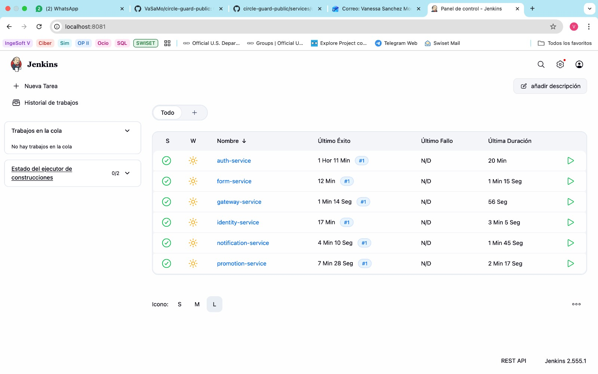
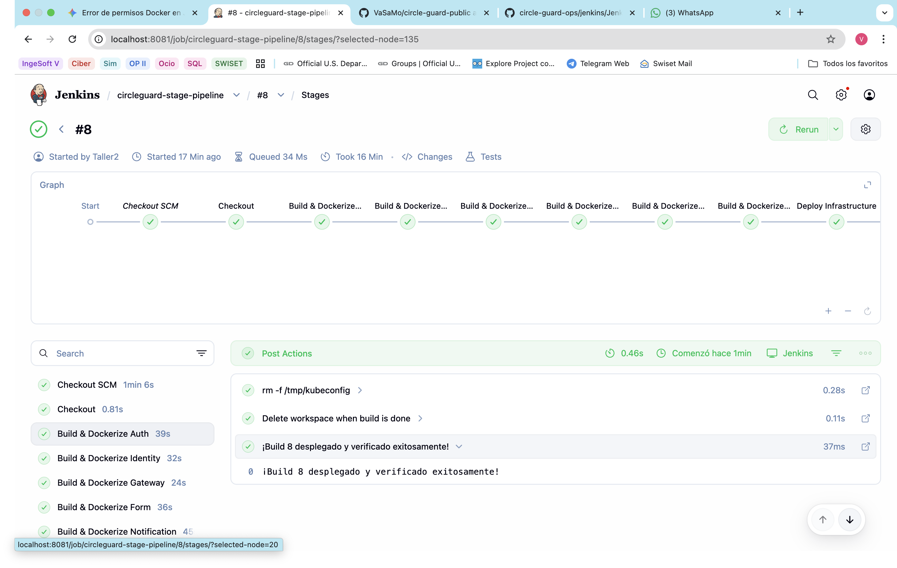
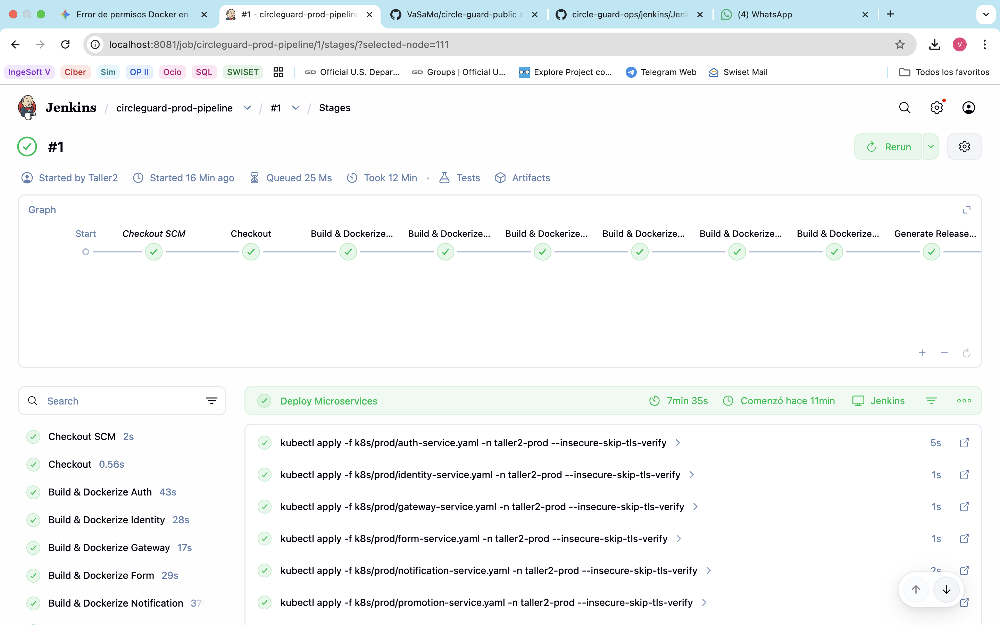
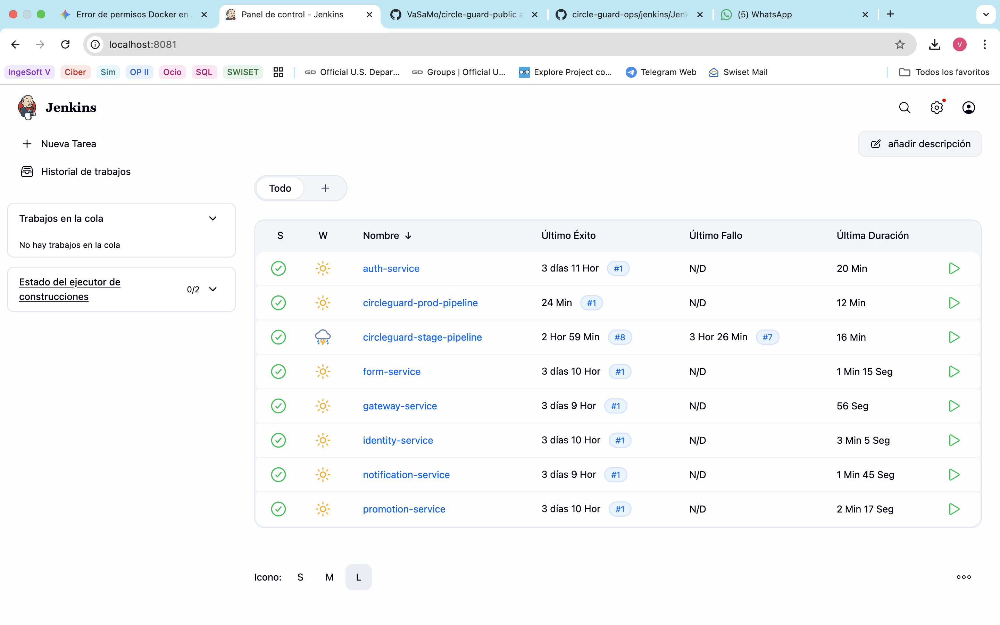
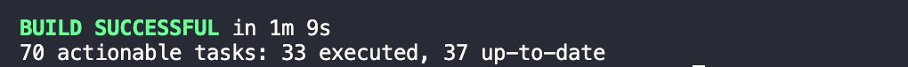
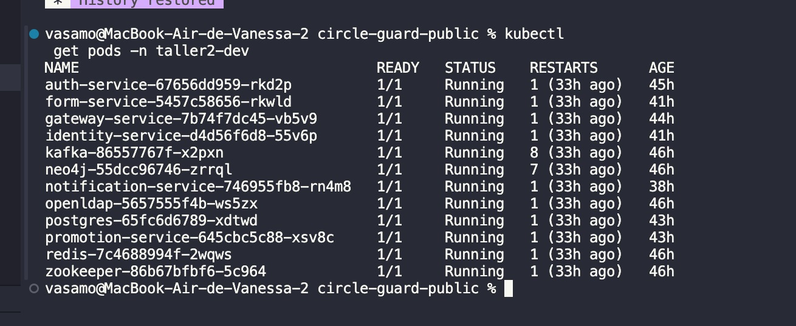
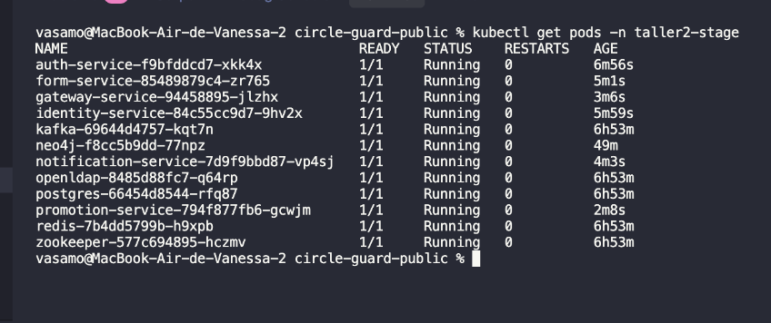
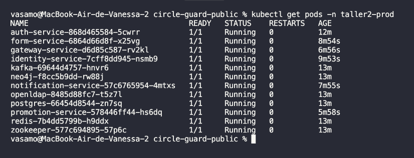
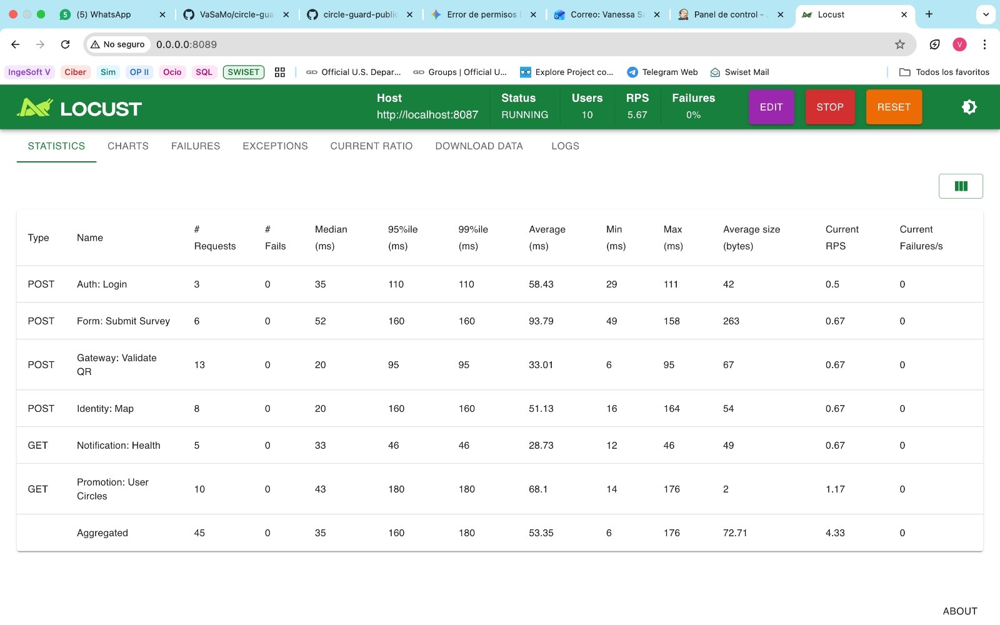

# Reporte: Taller de Pruebas y Release 261

## Índice
- [1. Configuración de los Pipelines](#1-configuración-de-los-pipelines)
  - [Capturas de Configuración](#capturas-de-configuración)
  - [Estructura General de las Pipelines](#estructura-general-de-las-pipelines)
  - [Infraestructura de Servicios y CI/CD](#infraestructura-de-servicios-y-cicd)
- [2. Resultados de las Ejecuciones](#2-resultados-de-las-ejecuciones)
  - [Capturas de Resultados y Pods](#capturas-de-resultados-y-pods)
- [3. Análisis de Pruebas de Rendimiento](#3-análisis-de-pruebas-de-rendimiento)
  - [Resumen de Resultados](#resumen-de-resultados)
  - [Análisis por Endpoints](#análisis-por-endpoints)

---

Este documento contiene las evidencias solicitadas para el cumplimiento de los objetivos del Taller de Pruebas y Release 261, documentando la configuración, ejecución exitosa y análisis de los pipelines y pruebas de rendimiento sobre la arquitectura de microservicios de CircleGuard.

---

## 1. Configuración de los Pipelines

Se implementó una estrategia de integración continua y despliegue continuo (CI/CD) distribuida en tres entornos:
- **Entorno DEV**: Cada microservicio cuenta con su propio `Jenkinsfile` interno dedicado a su construcción y despliegue independiente en el namespace `taller2-dev`.
- **Entornos STAGE y PROD**: Se diseñaron dos pipelines orquestadores principales (`Jenkinsfile` en la raíz para Stage y `Jenkinsfile.prod` para Producción) que automatizan el despliegue de toda la infraestructura y microservicios de forma conjunta.

### Capturas de Configuración

A continuación se muestran los pantallazos relevantes de la configuración en Jenkins:






### Estructura General de las Pipelines

**Pipeline de DEV (Microservicios individuales):**
Cada microservicio cuenta con este flujo secuencial:

```text
Checkout SCM Repo
      │
      ▼
Build  (gradlew clean build)
      │
      ▼
Docker Build  (docker build -t auth-service:latest)
      │
      ▼
Deploy to K8s  (kubectl apply -n taller2-dev + rollout restart)
```

**Pipeline de STAGE (Orquestador Principal):**
El flujo de integración continua en el entorno de pruebas:

```text
Checkout SCM Repo
      │
      ▼
Build & Dockerize  (Construcción secuencial de los 6 microservicios)
      │
      ▼
Deploy Infrastructure  (Postgres, Kafka, Neo4j, Redis, OpenLDAP en taller2-stage)
      │
      ▼
Deploy Microservices  (kubectl apply + rollout status de los 6 servicios)
      │
      ▼
Smoke Tests  (Port-forward y validación de endpoints /actuator/health)
```

**Pipeline de PROD (Orquestador de Producción):**
El flujo de entrega continua que incluye release notes:

```text
Checkout SCM Repo
      │
      ▼
Build & Dockerize  (Construcción secuencial de los 6 microservicios)
      │
      ▼
Generate Release Notes  (Extracción del changelog vía git log)
      │
      ▼
Deploy Infrastructure  (Postgres, Kafka, Neo4j, Redis, OpenLDAP en taller2-prod)
      │
      ▼
Deploy Microservices  (kubectl apply + rollout status de los 6 servicios)
      │
      ▼
System & Smoke Tests  (Port-forward y validación de endpoints /actuator/health)
```

> **Detalles clave de configuración:**
> - **Gestión de Memoria:** El pipeline ejecuta los builds con el parámetro `-Dorg.gradle.jvmargs='-Xmx512m'` para evitar problemas de memoria OutOfMemory (OOM) en los nodos de Jenkins durante el proceso de construcción concurrente.
> - **Imágenes Docker Optimizadas:** Todos los `Dockerfile` de los microservicios implementan un enfoque **Multi-stage Build**. En una primera etapa (`builder`) se extraen las capas del JAR de Spring Boot (`layertools`), y en la etapa final se copian de manera separada (dependencias, aplicación) hacia una imagen ligera `eclipse-temurin:21-jre-alpine` que usa `JarLauncher`. Esto optimiza significativamente la caché de Docker, los tiempos de construcción de Jenkins y el tamaño de la imagen final en el clúster.

<details>
<summary><b>Ver código fuente de Jenkinsfile (DEV - Auth Service)</b></summary>

```groovy
pipeline {
    agent any
    environment {
        SERVICE_NAME = "auth-service"
        NAMESPACE = "taller2-dev"
        IMAGE_NAME = "$SERVICE_NAME:latest"
        DOCKER_HOST = "unix:///var/run/docker.sock"
        TESTCONTAINERS_RYUK_DISABLED = "true"
    }
    stages {
        stage('Checkout') { steps { checkout scm } }
        stage('Build') { steps { dir("services/circleguard-$SERVICE_NAME") { sh "../../gradlew clean build" } } }
        stage('Docker Build') { steps { dir("services/circleguard-$SERVICE_NAME") { sh "docker build -t $IMAGE_NAME ." } } }
        stage('Deploy to K8s') {
            steps {
                withEnv(["KUBECONFIG=/tmp/kubeconfig"]) {
                    sh "kubectl apply -f k8s/dev/all-services.yaml -n $NAMESPACE --insecure-skip-tls-verify"
                    sh "kubectl rollout restart deployment/$SERVICE_NAME -n $NAMESPACE --insecure-skip-tls-verify"
                }
            }
        }
    }
}
```
</details>

<details>
<summary><b>Ver código fuente de Jenkinsfile (Stage)</b></summary>

```groovy
pipeline {
    agent any

    environment {
        NAMESPACE = "taller2-stage"
        DOCKER_HOST = "unix:///var/run/docker.sock"
        KUBECONFIG_PATH = "/tmp/kubeconfig"
    }

    stages {
        // [Extracto de las etapas principales]
        stage('Deploy Microservices') {
            steps {
                withEnv(["KUBECONFIG=${KUBECONFIG_PATH}"]) {
                    sh "kubectl apply -f k8s/stage/auth-service.yaml -n $NAMESPACE --insecure-skip-tls-verify"
                    sh "kubectl apply -f k8s/stage/identity-service.yaml -n $NAMESPACE --insecure-skip-tls-verify"
                    sh "kubectl apply -f k8s/stage/gateway-service.yaml -n $NAMESPACE --insecure-skip-tls-verify"
                    sh "kubectl apply -f k8s/stage/form-service.yaml -n $NAMESPACE --insecure-skip-tls-verify"
                    sh "kubectl apply -f k8s/stage/notification-service.yaml -n $NAMESPACE --insecure-skip-tls-verify"
                    sh "kubectl apply -f k8s/stage/promotion-service.yaml -n $NAMESPACE --insecure-skip-tls-verify"
                    
                    // Asegurar que los despliegues terminaron correctamente
                    sh "kubectl rollout restart deployment/auth-service -n $NAMESPACE --insecure-skip-tls-verify"
                    sh "kubectl rollout status deployment/auth-service -n $NAMESPACE --timeout=300s --insecure-skip-tls-verify"
                    // ... (demás servicios)
                }
            }
        }
        
        stage('Smoke Tests') {
            steps {
                withEnv(["KUBECONFIG=${KUBECONFIG_PATH}"]) {
                    sh '''
                        kubectl port-forward -n ${NAMESPACE} svc/gateway-service 8087:8087 --insecure-skip-tls-verify &
                        sleep 15
                        
                        STATUS=$(curl -s -o /dev/null -w "%{http_code}" http://localhost:8087/actuator/health)
                        if [ "$STATUS" = "200" ]; then
                            echo "SMOKE OK"
                        else
                            exit 1
                        fi
                        pkill -f "kubectl port-forward" || true
                    '''
                }
            }
        }
    }
}
```
</details>

<details>
<summary><b>Ver código fuente de Jenkinsfile.prod (Producción)</b></summary>

```groovy
pipeline {
    agent any

    environment {
        NAMESPACE = "taller2-prod"
        DOCKER_HOST = "unix:///var/run/docker.sock"
        KUBECONFIG_PATH = "/tmp/kubeconfig"
    }

    stages {
        // [Etapas idénticas a Stage de Build y Deploy omitidas por brevedad]
        
        stage('Generate Release Notes') {
            steps {
                script {
                    echo "Generando Release Notes automáticas basadas en historial de Git..."
                    sh '''
                        echo "# Release Notes - Entorno de Producción (Master)" > RELEASE_NOTES.md
                        echo "Generado automáticamente siguiendo las buenas prácticas de Change Management." >> RELEASE_NOTES.md
                        echo "" >> RELEASE_NOTES.md
                        echo "## Nuevas características y correcciones incluidas:" >> RELEASE_NOTES.md
                        
                        LATEST_TAG=$(git describe --tags --abbrev=0 2>/dev/null || echo "")
                        
                        if [ -z "$LATEST_TAG" ]; then
                            git log --pretty=format:"- %s (%h) por %an" >> RELEASE_NOTES.md
                        else
                            git log ${LATEST_TAG}..HEAD --pretty=format:"- %s (%h) por %an" >> RELEASE_NOTES.md
                        fi
                    '''
                    archiveArtifacts artifacts: 'RELEASE_NOTES.md', allowEmptyArchive: true
                }
            }
        }
    }
}
```
</details>

### Infraestructura de Servicios y CI/CD

**1. Servidor de CI/CD (Jenkins):**
Para aislar el entorno de construcción, Jenkins se ejecuta sobre un contenedor Docker customizado a partir de `jenkins/jenkins:lts`, aprovisionado mediante `docker-compose.yml`. Para permitir la contenedorización y el despliegue dentro del clúster, este contenedor incluye:
- El socket de Docker montado (`/var/run/docker.sock`) permitiendo operaciones de Docker-in-Docker para empaquetar los microservicios.
- Los binarios instalados de `docker-ce-cli` y `kubectl` directamente provistos en su `Dockerfile`.
- Las credenciales locales de Kubernetes (`~/.kube`) montadas como volumen para comunicación directa con el clúster local.

**2. Servicios de Apoyo (Infraestructura Kubernetes):**
La arquitectura depende de diversos componentes base desplegados automáticamente previo a los microservicios (mediante `infrastructure.yaml` y `postgres.yaml`):
- **Bases de datos relacionales:** Un despliegue de **PostgreSQL 16** con un *init-script* vía ConfigMap que crea bases separadas para cada microservicio (`circleguard_auth`, `circleguard_form`, etc.).
- **Gestor de Eventos Asíncronos:** Un broker de **Kafka 7.6.0** junto con **Zookeeper**, utilizados para el intercambio de mensajes y coreografía.
- **Base de datos de Grafos:** **Neo4j 5** (con plugin APOC), crucial para el motor de recomendación en el servicio de Promociones (`promotion-service`).
- **Sistema de Caché:** **Redis 7**, habilitado para optimizar lecturas.
- **Directorio de Usuarios:** **OpenLDAP 1.5.0**, configurado como origen de identidad (`circleguard.edu`) simulando un directorio corporativo.

---

## 2. Resultados de las Ejecuciones

Las ejecuciones de los pipelines fueron exitosas y lograron desplegar correctamente toda la infraestructura y microservicios en el clúster de Kubernetes en sus respectivos namespaces (`taller2-stage` y `taller2-prod`). Los *Smoke Tests* pasaron de forma positiva.

### Capturas de Resultados y Pods

- **Pruebas y Smoke Tests Exitosos:**


- **Pods Ejecutándose en el Entorno DEV / Local:**


- **Pods Ejecutándose en el Entorno STAGE (`taller2-stage`):**


- **Pods Ejecutándose en el Entorno PROD (`taller2-prod`):**


Todos los pods se encuentran en estado `Running` o `Completed` (para los jobs de inicialización), sin reinicios (CrashLoopBackOff).

---

## 3. Análisis de Pruebas de Rendimiento

Se ejecutaron pruebas de rendimiento utilizando **Locust** apuntando al Gateway (`localhost:8087`) y distribuyendo tráfico sobre los distintos microservicios subyacentes.

### Resumen de Resultados



| Métrica Global | Resultado |
| :--- | :--- |
| **Total Requests** | 96 |
| **Failures** | 0 |
| **Failure Rate** | 0.00% |
| **Throughput (Requests/s)** | 6.03 req/s |
| **Median Response Time** | 36 ms |
| **Average Response Time** | 56.8 ms |
| **Max Response Time** | 354.7 ms |
| **99% Percentile Response Time** | 350 ms |

### Análisis por Endpoints
- **Auth (Login):** Tiempo promedio de 78ms con un máximo de 201ms. Un rendimiento muy estable sin errores.
- **Form (Submit Survey):** Fue el endpoint más pesado con un promedio de 127ms y un máximo de 354ms, algo esperado por la persistencia de datos complejos.
- **Gateway (Validate QR):** Altamente optimizado. Tiempo promedio de respuesta de tan solo 25.6ms, manejando 1.56 peticiones por segundo.
- **Identity (Map):** Tiempos aceptables con un promedio de 60.8ms.
- **Notification (Health) y Promotion (User Circles):** Tiempos de respuesta muy bajos, ambos promediando por debajo de los 56ms.

> **Conclusión del Análisis:**
> La arquitectura responde con alta eficiencia y resiliencia bajo carga moderada. El **100% de éxito en las peticiones (tasa de error del 0%)** y el throughput sostenido de **6 req/s**, con picos de tiempos de respuesta por debajo de los 400ms para las operaciones más complejas, demuestra que el despliegue es altamente estable y los recursos asignados en el clúster a los pods son adecuados.
